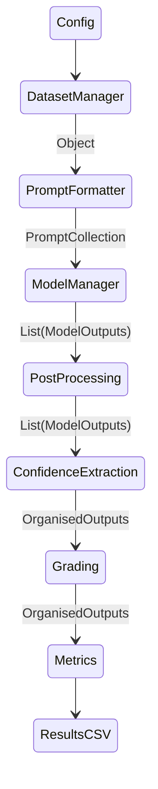

# LM Confidence Evaluation Harness

## Evaluation Framework Logic

```mermaid
stateDiagram
    Config --> DatasetManager
    DatasetManager --> PromptFormatter: Object
    PromptFormatter --> ModelManager: PromptCollection
    ModelManager --> PostProcessing: List(ModelOutputs)
    PostProcessing --> ConfidenceExtraction: List(ModelOutputs)
    ConfidenceExtraction --> Grading: OrganisedOutputs
    Grading --> Metrics: OrganisedOutputs
    Metrics --> ResultsCSV
```